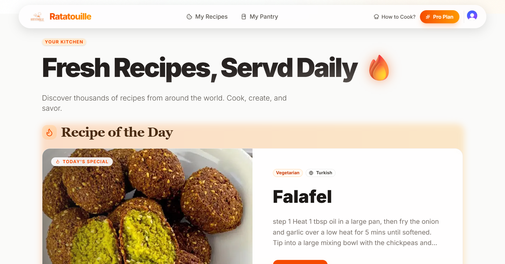
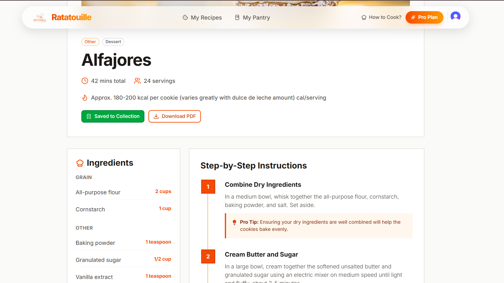

# 🍳 Ratatouille — AI Recipe Generator

Ratatouille is an **AI-powered cooking assistant** that generates complete recipes from the ingredients you already have.

Instead of searching for a specific dish, users can simply enter ingredients and let AI create a recipe with:

- Step-by-step cooking instructions
- Ingredient quantities
- Cooking tips
- Nutrition information

The platform also includes a **Free vs Pro plan system**:

🆓 **Free Plan** → Generate up to **5 recipes**  
💎 **Pro Plan** → **Unlimited recipe generation**

---

# 🚀 Live Demo

🔗 Add your deployed link here

---

# 🎬 Demo


This short demo shows:
- Entering ingredients
- Generating a recipe
- Viewing structured cooking steps

---

# 🖥️ Application Screenshots

## Landing Page



The landing page introduces the platform and allows users to quickly start generating recipes.

---

## Recipe Generation



Users receive a fully structured recipe including:
- Ingredients
- Cooking steps
- Nutrition details
- Helpful cooking tips

---

## Saved Recipes


Users can store generated recipes for future use and revisit them anytime.

---

# 🧠 Problem It Solves

Most recipe websites assume you already know **what dish you want to cook**.

But in real life cooking often starts with:

> "What can I cook with the ingredients I already have?"

Ratatouille solves this by allowing users to:

- Enter available ingredients
- Instantly generate recipes
- Discover new meal ideas without searching through multiple websites

---

# ⚙️ How It Works

1. User enters available ingredients  
2. AI processes the request  
3. Structured recipe content is generated  
4. The system returns formatted cooking instructions

Free users can generate up to **5 recipes**, while Pro users get **unlimited generation**.

---

# ✨ Features

- AI-powered recipe generation
- Ingredient-based search
- Free plan with 5 recipe limit
- Pro plan with unlimited recipes
- Save generated recipes
- Fast and responsive UI

---

# 🛠 Tech Stack

### Frontend
- Next.js
- React
- Tailwind CSS

### Backend
- Next.js API Routes
- AI API integration

### Other
- Usage tracking for free plan limits
- Authentication logic
- Server-side processing

---

# 📦 Installation

Clone the repository

```bash
git clone https://github.com/yourusername/ratatouille-ai-recipes.git
